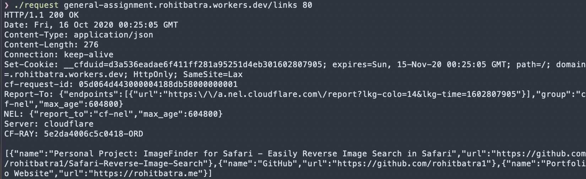
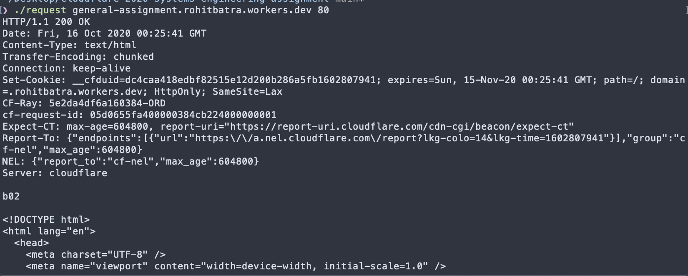

# Systems Assignment in C

## How to Install?
1. Ensure that the OpenSSL Path is included in LIBRARY_PATH.
2. CD into the directory of the project.
3. run the Makefile with "make"
4. run the program using ./request

## Details
• HTTP/HTTPS Connection is made via Port 80 Socket or Port 443 Socket with OpenSSL depending on connection type.

• No libraries were used to handle the HTTP/HTTPS requests

## Results
1. Cloudflare Worker Site Links

2. Cloudflare Worker Site

3. Youtube.com

4. Cloudflare.com Profile

5. Github.com Profile

6. Reddit.com Profile

7. Amazon.com Profile

